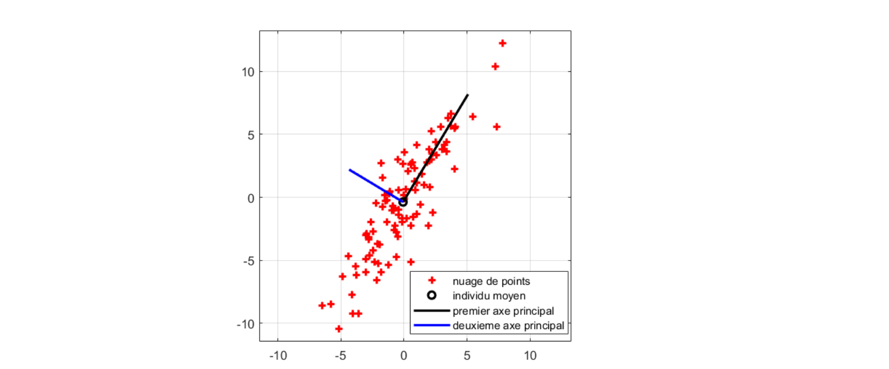
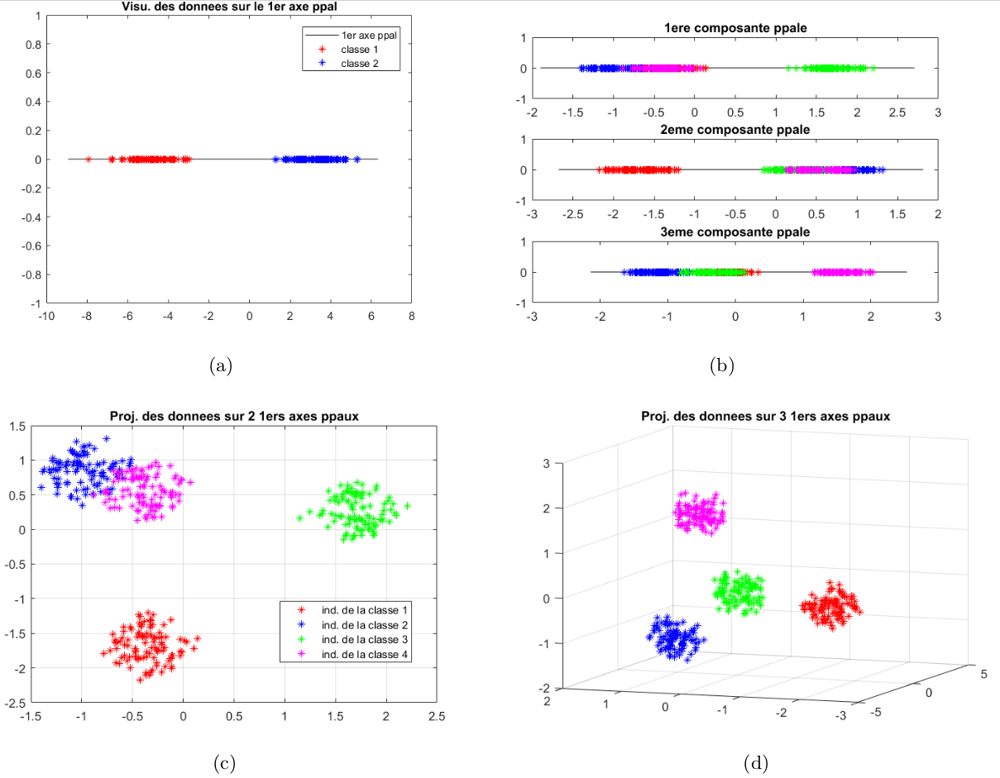

# TP-Projet 1 : Se familiariser avec l’Analyse en Composantes Principales (ACP)

### Projet de calcul scientifique et analyse de données - Modalités

Ce document constitue la première partie du projet de calcul scientifique et analyse de données. Ce projet s’effectue par équipe de trois étudiants issus d’un même groupe de TD, et est découpé en trois parties. Pour chacune, il y aura un TP-projet durant lequel votre enseignant vous donnera des informations pratiques et/ou théoriques pour vous aider à la réalisation des travaux en autonomie.
Tous les détails sur le déroulement de ce projet sont donnés sous Moodle, dans le document “Présentation projet 2021”

!!! note "Nota Bene"

    Les scripts Julia fournis dans cette partie s’appuient sur des jeux de données qui ont pour but d’illustrer les phénomènes décrits dans ce document, et ne sont bien sûr pas exhaustifs. Nous vous recommandons de créer vos propres jeux de données – aléatoirement avec les fonction rand et randn, en faisant varier les paramètres des lois, ou via des jeux de données trouvés sur internet –, et de noter dans le rapport vos remarques, interrogations et conclusions sur les observations que vous ferez en testant différents ensembles de données.

### Partie 1 : Visualiser les données

Lorsque l’on cherche à analyser un jeu de données, un réflexe naturel est d’essayer de visualiser ces données. En effet, leur distribution dans l’espace et la façon dont elles sont agencées les unes par rapport aux autres peuvent être des indices précieux sur leurs interactions.

“Voir” une donnée est un problème qui peut sembler trivial *a priori*, mais qui en fait ne l’est absolument pas dans la majeure partie des cas.

En effet :
* Pour visualiser une donnée qui s’exprime grâce à un unique nombre (un entier, un réel, un bit ...), on peut placer cette donnée sur une droite munie d’un repère  (une origine et un vecteur de base).
* Pour visualiser une donnée représentée par deux nombres – par exemple, la taille et le poids d’un être humain –, on peut la dessiner dans un plan, muni d’un repère (une origine et deux vecteurs de base).
* Pour visualiser une donnée représentée par trois nombres – par exemple le niveau de rouge, de vert et de bleu d’un pixel dans une image au format RVB –, on se sert d’un espace à trois dimensions (ce qui, sur ordinateur, est déjà une vue de l’esprit).
* Quant à la visualisation des données exprimées par plus de trois nombres, cela ne peut être réalisé sans un traitement préalable.

En bref, une donnée qui s'exprime comme un vecteur de ``\mathbb{R}^{p}`` se visualise naturellement, à condition que ``p \leq 3 .`` Or, de très nombreuses données s'expriment avec plus de trois variables.

Considérons par exemple un étudiant représenté par ses notes dans chacune des épreuves du semestre. Avec cet exemple, on se ramène à un tableau à double entrée. En effet, si on veut représenter une population d'étudiants que l'on qualifie via leurs notes, on va naturellement créer un tableau dans lequel chaque ligne est un étudiant, chaque colonne est une épreuve, et dans chaque case ``(i, j)`` on trouve la note que l'étudiant ``i`` a obtenue à l'épreuve ``j .`` On représente donc cette population par une matrice ``\mathbf{X} \in \mathbb{R}^{n \times p},`` avec ``n`` le nombre d'étudiants -ou individus-, et ``p`` le nombre d'épreuves -ou variables-.

En analyse de données, un tel tableau ``\mathbf{X}`` porte le nom de tableau des données. Cette représentation matricielle, alliée à des objets du domaine des statistiques, est extrêmement puissante car elle permet l'utilisation d'outils issus de l'algèbre linéaire, tels que l'Analyse en Composantes Principales (ACP).

**Question 1**: Quelles étaient les données sur lesquelles on a appliqué l'ACP pendant le TP n° 1 d'analyse de données "Espace de représentation des couleurs"? Expliquer formellement à quoi correspondait le tableau de données ``\mathbf{X}`` dans ce TP. Quelles étaient les dimensions des données?

**Question 2**: Compléter le script visualisation.jl fourni, aux endroits précisés dans le code.

### Partie 2 : L’Analyse en Composantes Principales

Pour répondre à la problématique de la visualisation des données, et d’une façon plus générale, pour réduire la dimension des individus sur lesquels on travaille, un outil classiquement utilisé est l’ACP. On peut l’expliquer globalement comme un changement de repère de l’espace des individus. Les axes de la nouvelle base sont triés dans l’ordre décroissant de l’information qu’ils permettent d’obtenir sur le jeu de données – ou, en d’autres termes, dans l’ordre décroissant de la proportion de contraste sur chacun de ces axes (voir document distribué lors du premier CTD d’Analyse de Données).

Dans ce nouveau repère, l’origine correspond à l’individu moyen (i.e. la moyenne des individus). En projetant l’ensemble des individus sur le premier axe de la nouvelle base, on obtient la meilleure approximation du tableau des données dans un espace à une dimension. En projetant les individus sur le plan créé par les deux premiers axes –le second étant orthogonal au premier–, on obtient la meilleure approximation de l’ensemble des données dans un espace à deux dimensions, etc. Les nouveaux axes sont décorrélés deux à deux.

**Rappels théoriques** : Le tableau des données ``\mathbf{X} \in \mathbb{R}^{n \times p}`` est constitué de ``n`` individus représentés par ``p`` variables. Autrement dit, chaque ligne ``i`` de ``\mathbf{X}`` correspond à une donnée (ou un individu) ``\mathbf{x}_{i} \in \mathbb{R}^{p} .`` On note ``\overline{\mathbf{x}}=\frac{1}{n} \sum_{i=1}^{n} \mathbf{x}_{i}`` l'individu moyen. On appelle tableau centré des données la matrice
``\\ \hspace*{4cm}``
``\mathbf{X}^{c}=\left[\begin{array}{c} \left(\mathbf{x}_{1}-\overline{\mathbf{x}}\right)^{\top} \\ \vdots \\ \left(\mathbf{x}_{n}-\overline{\mathbf{x}}\right)^{\top}\end{array}\right]=\left[\begin{array}{c} \mathbf{x}_{1}^{c} \top \\ \vdots \\ \mathbf{x}_{n}^{c} \top \end{array}\right]``

Figure 1 – Les points en rouge sont des vecteurs de ``\mathbb{R}^2`` . On les affiche dans le repère canonique dans lequel les données sont initialement exprimées. Puis on affiche dans ce repère le nouveau repère fourni par l’ACP. On voit que le premier axe correspond à la direction qui maximise la dispersion des données.

La matrice de variance/covariance ``\boldsymbol{\Sigma}=\frac{1}{n}\left(\mathbf{X}^{c}\right)^{\top} \mathbf{X}^{c} \in \mathbb{R}^{p \times p}`` indique le niveau de corrélation entre les axes de la base dans laquelle les individus sont initialement exprimées. Si ses éléments hors diagonale sont nuls, cela signifie que les variables sont décorrélées. Or, nous cherchons une base dans laquelle les variables sont décorrélées, et c'est la raison pour laquelle on cherche à diagonaliser ``\boldsymbol{\Sigma}``.
Puisque ``\boldsymbol{\Sigma}`` est symétrique, elle est diagonalisable dans une base orthonormée. Ainsi,
``\\ \hspace*{4cm}``
``\exists \mathbf{U}, \mathbf{D} \in \mathbb{R}^{p \times p}: \mathbf{\Sigma}=\mathbf{U D U}^{\top}``

avec U une matrice orthonormée, et D matrice diagonale, telle que ``\left|d_{1}\right| \geq\left|d_{2}\right| \geq \ldots \geq\left|d_{p}\right| .`` U est la matrice de passage de la base des axes principaux vers la base canonique, dans laquelle les données sont initialement exprimées. En outre, vu que U est orthonormée, U ``^{\top}`` est la matrice de passage de la base canonique vers la base principale.

Si l'on veut exprimer un individu ``\mathbf{x}_{i}`` dans ce nouveau repère, on applique d'abord le changement d'origine : ``\mathbf{x}_{i}^{c}=\mathbf{x}_{i}-\overline{\mathbf{x}},`` suivi du changement de base, i.e. le produit par la matrice de passage de la base canonique vers la base principale : ``\mathbf{c}_{i}=\mathbf{U}^{\top} \mathbf{x}_{i}^{c} .`` Le tableau des données dans le nouveau repère sera la concaténation des transposées de tous les individus, i.e. la concaténation des
``\\ \hspace*{4cm}``
``\mathbf{c}_{i}^{\top}=\left(\mathbf{U}^{\top} \mathbf{x}_{i}^{c}\right)^{\top}=\mathbf{x}_{i}^{c \top} \mathbf{U}, \forall i \in\{1 \ldots n\}``

On a donc la matrice ``\mathbf{C}=\mathbf{X}^{c} \mathbf{U}`` qui exprime bien les données dans le nouveau repère. La première colonne de ``\mathbf{C}`` correspond à la projection des individus sur le premier axe principal : il s'agit de la première composante principale de ``\mathbf{X} .`` De même, la deuxième colonne de ``\mathbf{C}`` correspond à la projection des individus sur le deuxième axe principal : il s'agit de la deuxième composante principale de X. Les colonnes suivantes de C correspondent aux composantes principales suivantes de X.

**Question 3**: Compléter le script ACP.jl aux endroits précisés dans le code. Répondre dans le rapport à la question posée dans les commentaires du code.

**Question 4**: Comment peut-on quantifier l'information contenue dans les ``q`` premières composantes principales à partir de la matrice ``\boldsymbol{\Sigma}`` ?

### Partie 3 : L’ACP et la classification de données

La classification de données est un domaine dans lequel on cherche à partitionner un ensemble de données en classes ou clusters, c’est-à-dire, en sous-groupes de l’ensemble initial. Les données d’un même sous-groupe présentent une certaine homogénéité, qu’elles ne partagent pas avec les données des autres sous-groupes. Les clusters forment une partition de l’ensemble des données.

En général, on définit une mesure de distance – ou à l’inverse, une mesure de proximité – sur l’espace des individus. Des données proches doivent appartenir au même cluster, des données éloignées doivent appartenir à des clusters différents. Quand les variables sont décorrélées, on peut utiliser la distance euclidienne pour mesurer l’écart entre les individus.

Si des groupes sont nettement définis, on les voit apparaı̂tre en visualisant les données avec l’ACP. Parfois, une seule composante suffit pour pouvoir définir chacune des classes. Parfois, plusieurs composantes sont nécessaires. Cela dépend notamment du nombre de classes. Deux exemples sont donnés à la Figure 2.

*Question 5*: Compléter le script classification.jl aux endroits précisés dans le code. Répondre dans le rapport aux questions posées dans les commentaires du code.

*Question 6*: Un fichier *dataset.jld2* est fourni. Ce fichier contient un tableau de données ``\mathbf{X} \in \mathbb{R}^{n \times p}`` représentant ``n`` individus et ``p`` variables. Combien de classes d’individus peut-on identifier dans ce jeu de données ? Complétez le script Julia *classes_individus.jl* permettant de visualiser le plus clairement possible ces différents clusters.

Indices :
* Inspirez-vous du script *classification.jl* pour observer les classes.
* Pour savoir combien de composantes principales sont nécessaires pour obtenir un taux d’information suffisant sur l’ensemble des données, on peut utiliser la proportion de contraste fournie par les éléments propres de la matrice de variance/covariance.
* Il est possible (mais pas obligatoire) d’utiliser la fonction kmeans de Julia (taper help kmeans pour plus d’information), qui correspond à l’algorithme des *k-moyennes* présenté en cours d’analyse de données (cf planches 37-51 du cours “Classification”). Cependant, la fonction *kmeans* doit être utilisée avec l’aide des observations faites sur les composantes principales, et la cohérence de ses résultats sur le jeu de données doit être vérifiée.

De nombreuses raisons peuvent amener à chercher des classes parmi un groupe d’individus. En reprenant notre exemple des étudiants et des notes, on pourrait par exemple vouloir automatiser la détection d’étudiants en difficulté. Mais pourquoi ne pas se servir de ces données pour analyser les matières préférées des étudiants – *a priori* celles où ils ont les meilleures notes –, et les matières qui leur posent problème ? En bref, pourquoi se limiter à classifier les individus, alors qu’on pourrait aussi classifier les variables.

**Question 7**: Dans le fichier *dataset.jld2*, combien de classes de variables peut-on identifier ? Ecrire un nouveau script Julia *classes_variables.jl* permettant de visualiser clairement ces classes.

Figure 2 – (a) : composante principale d’un nuage de points contenant deux classes : cette première composante suffit à mettre en évidence les deux classes. Les images (b), (c), (d) représentent un même nuage de points de ``\mathbb{R}^{30}`` – contenant quatre classes – dans trois configurations différentes : (b) : première, deuxième et troisième composantes principales du nuage. (c) : le nuage dans le repère défini par les deux premiers axes principaux. (c) : le nuage dans le repère défini par les trois premiers axes principaux.

### Partie 4 : l’ACP et la méthode de la puissance itérée

Dans les codes fournis, on récupère les éléments propres de Σ la matrice de variance/covariance par un simple appel à la fonction eigen de Julia, et on trie les vecteurs propres de Σ par ordre décroissant des valeurs propres associées, pour obtenir les axes principaux.

On pourrait aussi utiliser la très classique méthode de la puissance itérée avec déflation, qui renverrait les couples propres directement dans l’ordre voulu. L’algorithme de la puissance itérée pour trouver le couple propre dominant – i.e sans l’opération de déflation – est présenté ci-dessous.

**METHODE DE LA PUISSANCE ITÉRÉE** ``\\``
``\hspace*{0.5cm}``**Données** : une matrice ``\mathbf{M} \in \mathbb{R}^{p \times p},`` un vecteur normé ``\mathbf{x} \in \mathbb{R}^{p},`` une tolérance ``\epsilon>0,`` itmax nombre max d'itérations.``\\``
``\hspace*{0.5cm}``**Sortie** : ``(\lambda, \mathbf{x}) \in \mathbb{R} \times \mathbb{R}^{p}`` couple propre dominant de ``\mathbf{M} \\``
``\hspace*{0.5cm}``**Initialisation** : ``c v \leftarrow \text{FALSE}, i \leftarrow 0, \lambda \leftarrow \mathbf{x}^{\top} \mathbf{M} \mathbf{x} \\``
``\hspace*{0.5cm}``1. **Tant que** .NOT.cv:
``\hspace*{1cm}`` ``\mu \leftarrow \lambda \\``
``\hspace*{1cm}`` ``\mathbf{x} \leftarrow \mathbf{M} \mathbf{x} \\``
``\hspace*{1cm}`` ``\mathbf{x} \leftarrow \mathbf{x} /\|\mathbf{x}\| \\``
``\hspace*{1cm}`` ``\lambda \leftarrow \mathbf{x}^{\top} \mathbf{M} \mathbf{x} \\``
``\hspace*{1cm}`` ``i \leftarrow i+1 \\``
``\hspace*{1cm}`` ``c v \leftarrow\left(\frac{|\lambda-\mu|}{|\mu|} \leq \epsilon\right) . \text{OR} \cdot\left(i \geq i t_{\max }\right) \\``
``\hspace*{0.5cm}``2. **Retourner** ``(\lambda, \mathrm{x}) \\``

Les opérations de cet algorithme consistent majoritairement en des produits matrice-vecteur. Ainsi, la taille de la matrice ``\mathbf{M}`` est déterminante pour arriver rapidement à la convergence, en terme de temps de calcul.

**Question 8**: Soit une matrice rectangulaire ``\mathbf{H} \in \mathbb{R}^{p \times n} .`` Expliquer pourquoi connaitre les éléments propres - i.e. les valeurs propres et les vecteurs propres - de ``\mathbf{H}^{\top} \mathbf{H}`` permet de connaitre les éléments propres de ``\mathbf{H H}^{\top}``

Le script puissance_iteree.m contient deux instances de la méthode de la puissance itérée : une appliquée à une matrice ``\mathbf{A}^{\top} \mathbf{A},`` l'autre appliquée à la matrice ``\mathbf{A} \mathbf{A}^{\top} .`` La fonction cputime de Matlab permet de mesurer le temps d'exécution d'instructions.

**Question 9**: Compléter le script Matlab puissance_iteree.m aux endroits précisés dans le code. Répondre dans le rapport aux questions posées dans les commentaires du code.

**Question 10**: Lien avec l'ACP : est-il plus utile en théorie d'utiliser une fonction telle que eig ou la méthode de la puissance itérée pour calculer les éléments propres de ``\boldsymbol{\Sigma}`` si le but est d'effectuer une ACP pour réduire les dimensions d'un espace? Justifier.

**Question 11**: Si l'on choisit d'utiliser la méthode de la puissance itérée pour calculer les éléments propres de ``\boldsymbol{\Sigma},`` sur quelle matrice doit-on appliquer la méthode pour minimiser le temps de calcul et la mémoire utilisée?