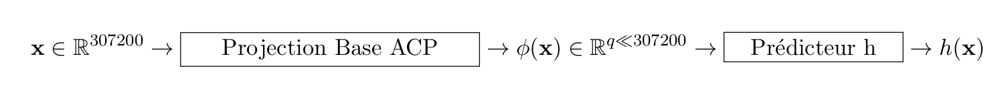

# TP-Projet 3 : Application de l’ACP : les "Eigenfaces"

Ce projet s’inspire d’un article intitulé *Eigenfaces for recognition*, écrit par Turk et Pentland et publié dans le *Journal of Cognitive Neuroscience* en 1991.

### Description des données

Vous disposez de ``n`` images de visages d'un ensemble d'individus. Chaque individu est photographié sous le même nombre de postures faciales (gauche, face, trois quart face, etc.). Chacune de ces ``n`` images en niveaux de gris est stockée dans une matrice bidimensionnelle de taille ``480 \times 640 .`` Ces ``n`` images constituent les images d'apprentissage. En les vectorisant, vous pouvez donc représenter ces images par des vecteurs colonnes de ``\mathbb{R}^{p},`` où ``p=480 \times 640=307200`` est le nombre de pixels commun à toutes les images. Alors que dans le ``\mathrm{TP} 1,`` chaque pixel d'une image couleur constitue un point de ``\mathbb{R}^{3},`` ici c'est chaque image qui constitue un point d'un espace affine ``\mathbb{R}^{p}`` de dimension très élevée.

### Exercice 1 : analyse en composantes principales

La matrice des données ``\mathrm{X},`` de taille ``n \times p,`` contient sur chaque ligne la transposée d'une image vectorisée. Lancez le script donnees.jl afin de créer cette matrice et de la stocker dans un fichier au format Matlab, de nom donnees.jld2.

**Attention, pour le TP, seuls 4 individus sur 37 et 4 postures sur 6 sont sélectionnées pour faire partie de la base d'apprentissage ; il faudra bien entendu considérer un plus grande nombre d'individus et de postures pour les tests de performance**

FIGURE 2 - Les "eigenfaces"

Complétez le script *exercice_1.jl*, qui vise à calculer les axes principaux des images d’apprentissage à partir des vecteurs propres associés aux ``n - 1`` valeurs propres non nulles de la matrice de variance/covariance ``\Sigma`` des données (comme ici on vous demande de calculer toutes les valeurs propres de la matrice (sauf une), le choix d’utiliser la fonction eigenva de soi) . Ces axes principaux sont appelés eigenfaces par Turk et Pentland, par contraction des mots anglais *eigenvectors* et *faces*.

### Exercice 2 : projection des images sur les eigenfaces

Une fois connues les ``n-1`` eigenfaces, on peut calculer les composantes principales. Complétez le script *exercice_2.jl*, de manière à afficher les images d'apprentissage reconstruites à l'aide des ``q`` premières eigenfaces et des ``q`` premières composantes principales, pour ``q \in[0, n-1]``

**Attention** : n'oubliez pas d'ajouter l'individu moyen.

Ce script doit également afficher l'évolution, en fonction de ``q,`` de la racine carrée de l'erreur quadratique moyenne ( *Root Mean Square Error*, ou RMSE) entre les images originales et les images ainsi reconstruites.

### Exercice 3 : application à la reconnaissance de visages

Le script *clusters.jl* calcule les composantes principales des ``n`` images d'apprentissage, puis affiche sous la forme d'un nuage de ``n`` points de ``\mathbb{R}^{2}`` leurs deux premières composantes principales. Chaque couleur correspond à un même individu de la *base d'apprentissage*. Ce nuage fait apparaitre des groupes de points (ou *clusters*) de couleur uniforme, ce qui montre que chaque *cluster* correspond aux différentes postures d'un même individu. Il semble donc possible d'utiliser les *eigenfaces* pour la reconnaissance de visages (comme l'indique le titre de l'article ayant inspiré ce TP : *Eigenfaces for recognition*), en calculant les deux premières composantes principales d'une image, dite *image de test*, n'appartenant pas forcément à la base d'apprentissage, et en cherchant de quelle image d'apprentissage cette image est la plus proche, donc à quel individu elle correspond.

Le script *exercice_3.jl* tire aléatoirement (à l’aide de la fonction randi de Matlab) une image de test,parmi les 37 personnes et les six postures faciales disponibles dans la base de données.

Figure 3 – Résultat d’une requête sur une base de visages.

### Travail en séance

- **Question 1** : *exercice_1.jl* complété
- **Question 2** : *exercice_2.jl* complété
- **Question 3** : *exercice_3.jl* complété

### Questions sur la reconnaissance de visages

1. **Evaluation de la reconnaissance :**
    - **Question 4:** Configurez un classifieur (type de classifieur 1 ppv, 3 ppv ou autre, ... vu en cours) en complétant le script *exercice_3.jl*. Le classifieur k-ppv a été vu au TP4 d'Analyse de Données.
    - **Question 5:** A partir des résultats obtenus de votre classifieur et des labels des images tests, construisez la matrice de confusion afin d'évaluer la qualité de votre classifieur. Comment optimiser votre classifieur? (on pourra notamment regarder le choix du nombre de composantes principales)

**N'oubliez pas que vous avez à disposition 37 individus et 6 postures**

2. **Discussion :**
    - **Question 6** : Compte tenu de la quantité de données fournie (nombre et taille des images), quelle est votre préconisation (algorithmique et informatique) pour le calcul des couples propres utiles à cette application?
    - **Question 7**: Faut-il utiliser l'implantation cholesky (via *eigen*) ou les algorithmes "subspace iteration"? (vous pouvez éprouver votre implantation Julia de ces algorithmes dans ce cadre) (Cette année, vu les conditions et l’obligation du travail à distance, nous avons enlevé l’interfaçage Matlab-Fortran qui permettait d’appeler le code Fortran des approches ”subspace iteration” à partir du Matlab.)
3. **Question 8 supplémentaire** : En travaillant sur tout ou partie de la Base d'Apprentissage, discutez de la pertinence (spectrale) de l'introduction de la couleur dans la reconnaissance des visages. Lancez le script *donneescouleur.jl* afin de créer cette matrice et de la stocker dans un fichier au format JLD2, de nom *donneesCouleur.jld2*.